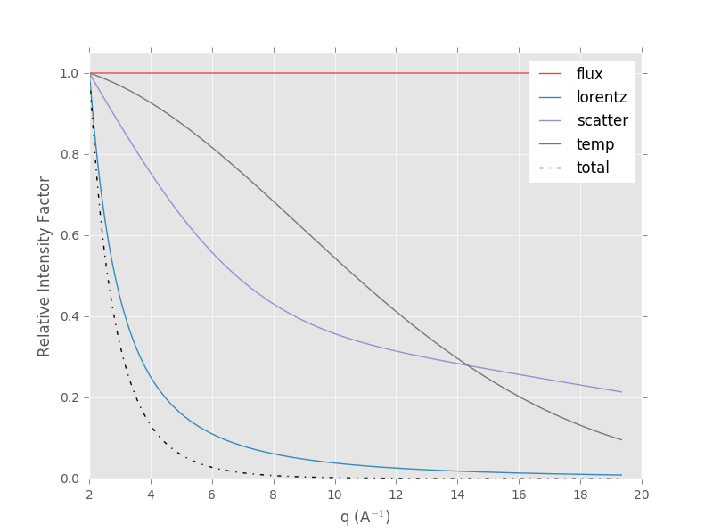

xrdpb: X-ray Diffraction (XRD) Pattern Builder
==============================================

What is xrdpb?
--------------

xrdpb is a utility to calculate and visualise powder diffraction profiles and the associated Debye-Scherrer rings in simple material systems. A detector (monochromatic area detector or energy dispersive detector array) and the experimental setup are defined before materials are 'added'. Multiple materials (or phases) can be introduced with a weight factor, which corresponds to the volume fraction of that material/phase.

A strain tensor can be defined and applied to the material(s). There is currently no option to apply a different strain state to each material/phase and no plan to implement this (until needed!).


Example Usage
-------------

If we consider a monochromatic x-ray source and a standard flat panel (area) detector then we will need to import MonoDetector and properly define the parameters and experiment (remembering lengths are in mm and energy in keV).

```python
>> from xrdpb.detectors import MonoDetector
>> mono = MonoDetector(shape=(2000,2000), pixel_size=0.2, 
                       sample_detector=700, energy=100, 
                       energy_sigma=0.5)
```
If we want to work with an 80% Fe, 20% Cu mix, then we could calculate and vizualise the 1D diffraction profile using the add_peaks and plot_intensity commands. The background argument allows you to add an amount of noise relative to the maximum peak height - the impact of this can be seen in the 'total' line profile. The intensity profile extraction/plotting can be done at any arbitrary azimuthal angle (phi) - this is particularly useful when the material is subject to a strain.
```python
>> mono.add_peaks('Fe', weight=0.8)
>> mono.add_peaks('Cu', weight=0.2)
>> mono.plot_intensity(phi=np.pi/2, background=0.01, strain_tensor=(0,0,0))
```

When interacting with an area detector it is also possible to vizualise the full Deby-Scherrer rings. In this case, we have applied a strain to the material.
```python
>> mono.plot_rings(strain_tensor=(0.2, 0.2, 0.05)
```


Note that the intensity factor calculations that underpin the profile calculations can be vizualised using the intensity_factor command (and a specified material/phase)

```python
>> mono.intensity_factors('Fe', plot=True))
```


If you need to access the 1D/2D intensity data the 'intensity' and 'rings' methods can be called:
```python
>> mono.intensity(phi=np.pi/2, background=0.01, strain_tensor=(0,0,0))
>> mono.rings(strain_tensor=(0.2, 0.2, 0.05)
```


Requirements
------------

xrdpb is built on Python’s scientific stack (numpy, scipy, matplotlib). Testing and development were carried out using the Anaconda scientific Python distribution (v 4.1), which built with the following packages:

-	Python: version 2.7.11 and 3.5.1
-	numpy: version 1.10.4
-	scipy: version 0.17
-	matplotlib: version 1.5

Compatability is expected with earlier versions of Python, numpy, scipy and matplotlib but this has not been tested.

Installation
------------

You can install xrdpb from source using the setup.py script. The source is stored in the GitHub repo, which can be browsed at:

https://github.com/casimp/xrdpb

Simply download and unpack, then navigate to the download directory and run the following from the command-line:

```
python setup.py install
```
